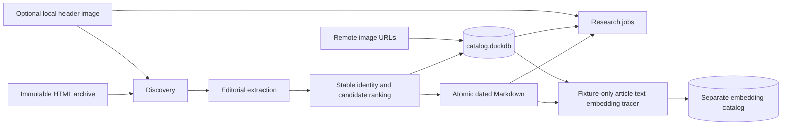

# WSJ Markdown catalog architecture crash course

This is the deep guide to the pipeline's data model, implementation, failure
semantics, and extension workflow. Start with the concise operator path in the
[README](../README.md) if you only need to run or query the pipeline.

## 1. Research mental model

Treat preprocessing as a deterministic adapter between an immutable licensed
archive and many independent research projects.

The input unit is a WSJ HTML file plus an optional sibling header image. The
output unit is a stable article identity with exactly one winning Markdown file
and one `articles` row. Several source files may be candidates for the same
identity; operational tables preserve their provenance and ranking without
storing article bodies.

The shared layer answers only four research questions:

1. What canonical editorial text belongs to this article?
2. When was it published, exactly and on the New York calendar?
3. Which local header image and remote editorial-image URLs belong to it?
4. Where did it come from, and can the result be reproduced incrementally?

Production embeddings, entity extraction, knowledge graphs, market joins,
labels, backtests, and remote-image retrieval remain downstream concerns; the
shared preprocessing catalog does not own them.

The downstream embedding slice consumes canonical `articles` rows, Markdown,
and optional local header images through one coordinator seam and publishes a
separate embedding catalog. Smoke injects a deterministic fake adapter, while an explicit pilot
sends only fixed in-memory generated text and PNG bytes through hosted Jina.
The production command exposes only an affirmatively authorized positive limit
of lexical article IDs. Durable per-modality checkpoints resume unchanged work;
an absent image is explicitly `not_applicable`, and remote editorial-image URLs
are never image work. Full-corpus workflows remain unavailable.



## 2. One article's journey

1. `discovery.py` recursively finds `.html` files in lexical relative-path
   order. Hidden directories and `__MACOSX` are skipped at every depth; only a
   top-level directory named `backup` is skipped. A nested editorial directory
   named `backup` remains discoverable.
2. Discovery looks beside the HTML for
   `<stem>_main_image.{jpg,jpeg,png,webp}`. That extension order is the winner
   priority. No image is valid; multiple images produce a warning.
3. The coordinator compares the manifest's HTML and selected-image sizes and
   nanosecond mtimes, then classifies the source for preparation.
4. A bounded worker verifies regular source files and safely reads only what
   that classification requires. Matching fingerprints skip extraction. An
   HTML stat-only change is hashed; if the hash matches and the image
   fingerprint did not change, only the manifest is refreshed. Workers never
   own a catalog connection or generated-output write capability.
5. `extract.py` hashes the HTML, reads authoritative publication metadata,
   derives identity, and renders editorial content to deterministic Markdown.
   Missing, malformed, or timezone-naive publication time is a structured
   extraction failure.
6. The candidate is compared with every source carrying the same `article_id`.
   The deterministic best candidate becomes the winner.
7. Its Markdown is written to a run-specific staging directory, reopened,
   SHA-256 checked, and atomically replaced at its dated final path.
8. The serialized coordinator updates the winner, candidate, duplicate,
   failure, and
   manifest state. Nonwinners retain metrics and provenance, not cleaned text.
9. Validation checks the catalog and files while the mutating run still owns
   the exclusive lock. On the normal result path, the CLI returns a
   content-free JSON summary.

The final path is:

```text
text/YYYY/MM/DD/<sha256-of-full-namespaced-article-id>.md
```

`YYYY/MM/DD` is `publication_date_new_york`, not a folder hint or filesystem
date.

## 3. Module map

### Preprocessing modules

| Module | Owns | Does not own |
|---|---|---|
| `config.py` | resolved source/output roots, batch size, worker count, nonoverlap check | command behavior |
| `models.py` | immutable records crossing discovery/extraction boundaries | persistence |
| `discovery.py` | stable HTML enumeration and header-image pairing | HTML parsing |
| `extract.py` | metadata, dates, identity, editorial Markdown, remote image URLs | winner persistence |
| `catalog.py` | schema version 1, transactions, manifests, candidates, audit rows | filesystem publication |
| `pipeline.py` | locking, classification, batching, ranking, publication, reconciliation | research transforms |
| `validate.py` | catalog/file/date/hash/path/URL/orphan invariants | repair |
| `cli.py` | four commands, scope safety, deterministic JSON, exit status | domain logic |

The command surface is exactly `inventory`, `run`, `validate`, and `smoke`.
Only `run` mutates configured state. It requires exactly one of a positive
`--limit N` or `--full`; `--reprocess` and a positive `--workers N` override
are valid only with that scope. Configuration defaults to four workers.
`inventory` is read-only and inventories the whole configured source root.
`smoke` ignores configuration and uses a generated temporary archive.

### Article text embedding tracer modules

| Module | Owns | Does not own |
|---|---|---|
| `wsj_embeddings/config.py` | resolved disjoint roots and explicit hosted-processing authorization | CLI configuration loading |
| `wsj_embeddings/adapters.py` | injected adapter protocol, deterministic fake adapter, and fixed hosted Jina adapter | corpus selection or output mutation |
| `wsj_embeddings/tokenizer.py` | immutable official v4 tokenizer revision, artifact checksum verification, and lazy in-memory loading with pinned `tokenizers-0.21.4` | hosted inference or model self-hosting |
| `wsj_embeddings/long_text.py` | exact token accounting, deterministic Markdown block packing, and reversible oversized-block partitioning | API calls or checkpoint mutation |
| `wsj_embeddings/canonical_markdown.py` | descriptor-relative, no-follow, replacement-detecting canonical Markdown reads | preprocessing publication |
| `wsj_embeddings/source_image.py` | descriptor-relative, no-follow, replacement-detecting local header-image reads | remote URL retrieval |
| `wsj_embeddings/image_rendition.py` | bounded image decode, exact-byte eligibility, deterministic Pillow rendition, and atomic derived-file installation | source-image mutation or hosted requests |
| `wsj_embeddings/batching.py` | mixed-input payload packing, bounded concurrency, rate-aware retry waves, and safe observations | HTTP serialization or catalog publication |
| `wsj_embeddings/catalog.py` | separate schema version 12, exact read-only inspection, bounded lifecycle/generation/part/provenance transactions | preprocessing catalog mutation |
| `wsj_embeddings/pipeline.py` | read-only eligibility inventory, authorization gate, bounded lexical selection, text/image encoding, composite derivation, hashes, and publication | hosted credential loading |
| `wsj_embeddings/validate.py` | read-only schema, run coverage, cross-catalog, provenance, hash, metadata, and vector checks | repair |
| `wsj_embeddings/smoke.py` | generated canonical fixture and unchanged-input assertion | licensed archive access |
| `wsj_embeddings/pilot.py` | fixed generated hosted text/image/boundary probes and content-free observations | corpus or filesystem input/output |
| `wsj_embeddings/cli.py` | `smoke`, `pilot`, credential-free `inventory`, and authorized limit-only production `run` with bounded reprocess | preprocessing mutation or full embedding reconciliation |

The installed `wsj-embeddings` command accepts `smoke`, `pilot`, `inventory`,
and `run`. `smoke`
creates three disjoint temporary roots, publishes one fake 2,048-dimensional
`article_text` vector, validates it, emits
`{"articles": 1, "embeddings": 1, "validation_ok": true}`, and deletes the
temporary fixture. `pilot` has no selectors and, only with `JINA_API_KEY`, uses
the hosted adapter for its fixed generated probes without creating a catalog or
output root. `inventory` performs a read-only aggregate over canonical winners
without constructing an adapter or requiring `JINA_API_KEY`. `run` requires a
positive `--limit`, three explicit disjoint roots, and
`--authorize-hosted-processing`; it selects by `ORDER BY article_id LIMIT ?`,
uses the production Jina adapter with truncation disabled, and never reconciles
unselected rows. Optional `--reprocess` regenerates article text only in that
selected limit while reusing unchanged independent header-image work,
and success JSON includes its deterministic `configuration_id`. The existing
`wsj-pipeline` command surface is unchanged.

## 4. Cleaned Markdown contract

The canonical file is UTF-8 Markdown in editorial reading order. Extraction
preserves, when present:

- headline; distinct subtitle, dek, and summary; and byline;
- body paragraphs and section headings;
- ordered and unordered lists, tables, and block quotes;
- editorial hyperlinks;
- inline figures and images at their approximate DOM position;
- image alt text, caption, credit, and creator text; and
- relevant visible text in article interactives.

It excludes navigation, ads and tracking, subscription/login/registration
prompts, recommendations and related cards, sharing controls, biographies,
scripts, styles, iframes, hidden nodes, and repeated metadata. Repeated body
text is not deduplicated merely because its words match.

A synthetic shape looks like this:

```markdown
# Example headline

Example dek.

By Example Reporter

Opening paragraph with an [editorial link](https://example.test/story).

## Example section


Example caption. Example credit.
```

Normalization cleans whitespace, applies Unicode normalization, escapes
Markdown control characters, uses deterministic blank lines, and preserves
meaning. It does not paraphrase, translate, lowercase, stem, or summarize.

Only resolved HTTP(S) editorial image URLs enter Markdown and the ordered,
deduplicated `inline_image_urls` list. The pipeline never downloads them. The
local companion header image is a separate nullable source-relative path and
is not injected into article Markdown.

## 5. Catalog schema

The preprocessing output's `catalog.duckdb` is both its research catalog and
operational state store. Opening an unsupported or malformed schema fails with
instructions to move the derived output aside or choose a fresh output root.
There is no silent migration or deletion. Public validation uses the same exact
table, column, key, constraint, and index contract through a read-only
connection.

### Research-facing table

| `articles` column | DuckDB type | Meaning |
|---|---|---|
| `article_id` | `VARCHAR` | primary key; stable namespaced identity |
| `source_html_path` | `VARCHAR` | unique winning path relative to source root |
| `cleaned_markdown_path` | `VARCHAR` | unique path relative to output root |
| `header_image_path` | `VARCHAR` | nullable path relative to source root |
| `inline_image_urls` | `VARCHAR[]` | ordered, deduplicated remote HTTP(S) URLs |
| `published_at_utc` | `TIMESTAMPTZ` | exact publication instant |
| `publication_date_new_york` | `DATE` | indexed New York research date |
| `cleaned_markdown_sha256` | `VARCHAR` | hash of published Markdown bytes |

The nonunique `articles_publication_date_idx` covers
`(publication_date_new_york, published_at_utc, article_id)`.

### Operational tables

| Table | Primary key | Stored state |
|---|---|---|
| `metadata` | `key` | catalog schema version |
| `runs` | `run_id` | command, scope, status, start/finish times, content-free JSON counts |
| `source_manifest` | `source_html_path` | HTML/image fingerprints, HTML hash, extractor version, status, identity, last-run/last-seen IDs |
| `candidates` | `source_html_path` | identity, URL, dates, ranking metrics, image references, warnings, last run |
| `duplicates` | `(article_id, source_html_path)` | winner path, rank, reason, run ID |
| `failures` | `(run_id, source_html_path, stage)` | stable code and catalog-owned content-free message |

Operational rows contain no cleaned article body. `candidates` retains only
quality counts and metadata needed to rerank a stored source; a candidate is
re-extracted from immutable input if it must be promoted and cannot reuse the
current published winner.

A typical research query is:

```sql
SELECT
    article_id,
    cleaned_markdown_path,
    header_image_path,
    inline_image_urls,
    published_at_utc,
    publication_date_new_york
FROM articles
WHERE publication_date_new_york
      BETWEEN DATE '2024-01-01' AND DATE '2024-01-31'
ORDER BY published_at_utc, article_id;
```

### Separate text, header-image, and multimodal embedding catalog

The fixture tracer writes a second `catalog.duckdb` only below its disjoint
embedding output root. It never adds fields or tables to the preprocessing
catalog. Embedding schema version 12 has exactly eleven base tables, no views,
and no indexes. Versions 1 through 11 and malformed output are refused without
migration.

| Table | Ordered columns and DuckDB types | Primary key |
|---|---|---|
| `metadata` | `key VARCHAR`, `value VARCHAR` | `key` |
| `embedding_configurations` | `configuration_id VARCHAR`, `model VARCHAR`, `observed_model VARCHAR`, `observed_api_version VARCHAR`, `task VARCHAR`, `dimensions INTEGER`, `output_type VARCHAR`, `normalization VARCHAR`, `tokenizer_revision VARCHAR`, `tokenizer_engine VARCHAR`, `context_token_limit INTEGER`, `context_rules VARCHAR`, `long_text_aggregation VARCHAR`, `long_text_part_attempt_limit INTEGER`, `batch_max_items INTEGER`, `batch_max_estimated_tokens INTEGER`, `batch_max_encoded_bytes BIGINT`, `batch_max_concurrency INTEGER`, `batch_max_attempts INTEGER`, `batch_initial_backoff_seconds DOUBLE`, `batch_max_backoff_seconds DOUBLE`, `image_input_rules VARCHAR`, `image_transform VARCHAR`, `multimodal_formula VARCHAR`, `client_configuration_version VARCHAR` | `configuration_id` |
| `runs` | `run_id VARCHAR`, `configuration_id VARCHAR`, `articles INTEGER`, `embeddings INTEGER`, `reused INTEGER`, `attempted INTEGER`, `succeeded INTEGER`, `retryable INTEGER`, `terminal INTEGER`, `interrupted INTEGER`, `header_absent INTEGER`, `header_failed INTEGER`, `hosted_requests INTEGER`, `hosted_retries INTEGER`, `usage_json VARCHAR`, `throttles INTEGER`, `elapsed_seconds DOUBLE`, `started_at TIMESTAMPTZ` | `run_id` |
| `embedding_work_items` | `article_id VARCHAR`, `modality VARCHAR`, `configuration_id VARCHAR`, `source_relative_path VARCHAR`, `input_sha256 VARCHAR`, `state VARCHAR`, `attempt_count INTEGER`, `error_code VARCHAR`, `status_code INTEGER`, `retry_after_seconds DOUBLE`, `last_run_id VARCHAR`, `generation_run_id VARCHAR`, `updated_at TIMESTAMPTZ` | `(article_id, modality, configuration_id)` |
| `embeddings` | `article_id VARCHAR`, `modality VARCHAR`, `configuration_id VARCHAR`, `source_relative_path VARCHAR`, `published_at_utc TIMESTAMPTZ`, `publication_date_new_york DATE`, `dimensions INTEGER`, `input_sha256 VARCHAR`, `stored_vector_sha256 VARCHAR`, `vector FLOAT[2048]` | `(article_id, modality, configuration_id)` |
| `embedding_generation_history` | `article_id VARCHAR`, `modality VARCHAR`, `configuration_id VARCHAR`, `generation_run_id VARCHAR`, `source_relative_path VARCHAR`, `input_sha256 VARCHAR`, `stored_vector_sha256 VARCHAR`, `superseded_run_id VARCHAR`, `superseded_reason VARCHAR`, `superseded_at TIMESTAMPTZ` | `(article_id, modality, configuration_id, generation_run_id)` |
| `multimodal_embedding_provenance` | `article_id VARCHAR`, `configuration_id VARCHAR`, `generation_run_id VARCHAR`, `text_generation_run_id VARCHAR`, `text_stored_vector_sha256 VARCHAR`, `header_image_generation_run_id VARCHAR`, `header_image_stored_vector_sha256 VARCHAR`, `formula_version VARCHAR`, `created_at TIMESTAMPTZ` | `(article_id, configuration_id, generation_run_id)` |
| `image_input_provenance` | `article_id VARCHAR`, `configuration_id VARCHAR`, `generation_run_id VARCHAR`, `source_sha256 VARCHAR`, `source_format VARCHAR`, `source_bytes BIGINT`, `source_width INTEGER`, `source_height INTEGER`, `source_frames INTEGER`, `embedded_input_sha256 VARCHAR`, `embedded_format VARCHAR`, `embedded_bytes BIGINT`, `embedded_width INTEGER`, `embedded_height INTEGER`, `embedded_frames INTEGER`, `transform_id VARCHAR`, `rendition_relative_path VARCHAR`, `created_at TIMESTAMPTZ` | `(article_id, configuration_id, generation_run_id)` |
| `long_text_parts` | `article_id VARCHAR`, `configuration_id VARCHAR`, `article_input_sha256 VARCHAR`, `part_index INTEGER`, `part_count INTEGER`, `char_start BIGINT`, `char_end BIGINT`, `byte_start BIGINT`, `byte_end BIGINT`, `part_input_sha256 VARCHAR`, `token_count INTEGER`, `state VARCHAR`, `attempt_count INTEGER`, `error_code VARCHAR`, `status_code INTEGER`, `retry_after_seconds DOUBLE`, `last_run_id VARCHAR`, `generation_run_id VARCHAR`, `stored_vector_sha256 VARCHAR`, `vector FLOAT[2048]`, `updated_at TIMESTAMPTZ` | `(article_id, configuration_id, article_input_sha256, part_index)` |
| `long_text_part_generations` | `article_id VARCHAR`, `configuration_id VARCHAR`, `article_input_sha256 VARCHAR`, `part_index INTEGER`, `generation_run_id VARCHAR`, `part_count INTEGER`, `char_start BIGINT`, `char_end BIGINT`, `byte_start BIGINT`, `byte_end BIGINT`, `part_input_sha256 VARCHAR`, `token_count INTEGER`, `stored_vector_sha256 VARCHAR`, `vector FLOAT[2048]`, `created_at TIMESTAMPTZ` | `(article_id, configuration_id, article_input_sha256, part_index, generation_run_id)` |
| `article_text_aggregation_provenance` | `article_id VARCHAR`, `configuration_id VARCHAR`, `generation_run_id VARCHAR`, `part_index INTEGER`, `article_input_sha256 VARCHAR`, `part_count INTEGER`, `part_generation_run_id VARCHAR`, `part_input_sha256 VARCHAR`, `token_count INTEGER`, `part_stored_vector_sha256 VARCHAR`, `aggregation_version VARCHAR`, `created_at TIMESTAMPTZ` | `(article_id, configuration_id, generation_run_id, part_index)` |

`configuration_id` is the SHA-256 of compact, key-sorted JSON for every
`EmbeddingProfile` field: model alias and observed hosted model/API metadata,
task, dimensions, output type, normalization, tokenizer artifact/engine,
context rules/ceiling, long-text aggregation/attempt limit, batching
payload/concurrency/retry policy, image rules/transform, multimodal formula,
and client configuration version. The
tokenizer engine is pinned as `tokenizers-0.21.4`. The official local tokenizer artifact is
`jinaai/jina-embeddings-v4/tokenizer.json` at immutable revision
`d1e5d70b7b34d927a8cddac458583c4fbe50a914`, accepted only when its bytes match
SHA-256 `9c5ae00e602b8860cbd784ba82a8aa14e8feecec692e7076590d014d7b7fdafa`.
Verified UTF-8 bytes are loaded directly from memory rather than reopening the
resolved path. This pins token boundaries without self-hosting the model. The
conservative input ceiling is 8,000 tokens, leaving 192 tokens of framing
headroom below the confirmed 8,192-token model context. Inputs at or below it
keep one hosted request with `truncate=false`. Longer Markdown is greedily packed at complete
blank-line block separators, with one oversized block partitioned only on safe
token offsets. Every part is an exact, ordered, non-overlapping substring.
The current long-text identity is
`l2-token-count-weighted-mean-float32-v1`: normalized parts contribute by exact
token count to one float32 L2-normalized `article_text` vector. `input_sha256` covers the exact UTF-8
canonical Markdown or exact local header-image bytes; for a composite it covers
only the two source-generation identities/vector hashes and formula. After
finite/nonzero checks and L2 normalization,
values are rounded to
float32; `stored_vector_sha256` covers their concatenated little-endian float32
representation. Work state is one of `queued`, `in_progress`, `succeeded`,
`retryable`, `terminal`, `interrupted`, or `not_applicable`. The supported
vector modalities are `article_text`, `header_image`, and `multimodal_article`,
all dimension 2,048.
`long_text_parts` is mutable operational checkpoint/vector state, not a fourth
research modality. `long_text_part_generations` is append-only operational
history, including exact character/UTF-8 byte spans and vector facts needed to
audit an aggregate without retaining Markdown. A part success commits before
the next hosted call, so a crash or retryable failure repurchases only unproven
parts. Retryable errors become terminal on the third committed attempt; the
part, parent article work, and run counter transition atomically. Replay repairs
a legacy split terminal or an interrupted attempt-three checkpoint without an
additional hosted call. Ordinary replay preserves that terminal disposition;
explicit reprocess instead resets every mutable part checkpoint in one
transaction before the first new hosted part call.
Explicit reprocess clears the current checkpoint but never a generation named
by active or archived aggregate provenance. Aggregate provenance links the one
research vector to each immutable part generation, content hash, token count,
and stored-vector hash. Changed Markdown selects a new
article input identity; changed tokenizer, ceiling, boundary rule, or formula
selects a new `configuration_id`. In both cases stale parts cannot satisfy the
new aggregate, and normal source invalidation also archives/removes the dependent
same-configuration multimodal generation.
`source_relative_path` records the archive-relative path only for image work;
no-header work keeps both path and input hash null and never publishes a vector.
The only other null input hash is the narrow missing-header retryable
disposition: it retains a safe canonical relative path and
`missing_header_image`, has zero adapter attempts, and has no active vector or
generation. Content-free `header_absent` and `header_failed` run counters keep
that distinction visible in public summaries.

A static JPEG, PNG, or WebP at or below 5,000,000 bytes and 20,000,000 pixels
is fully decoded and sent as its exact immutable source bytes. An oversized
input is accepted for decoding only through 40,000,000 pixels, EXIF-oriented,
converted to metadata-free RGB on white, aspect-scaled only when above the
hosted pixel ceiling, and encoded as JPEG by exactly Pillow 11.3.0 with quality
85, 4:2:0 subsampling, Lanczos resize, and progressive/optimize disabled. This
conservative transform is implementation policy pending a credentialed
synthetic pilot that confirms the live image contract. Both the input rules and
transform ID participate in `configuration_id`. The runtime transform ID also
binds the linked JPEG, libjpeg-turbo, zlib, and WebP build versions; codec/profile
ambiguity fails before configuration or work publication. The production Pillow
path remains unexecuted in the shared environment and requires Task 14/ticket
15's clean-install synthetic verification.

The rendition is staged below `renditions/<transform-hash>/`, fsynced, reopened,
decoded, byte-compared, hashed, and atomically installed. After decode the full
output-root/rendition/transform/leaf chain is reanchored, and an immutable
identity token makes the coordinator repeat that verification immediately
before run-state mutation. `image_input_provenance` stores source and exact embedded
input hashes, formats, byte counts, dimensions, frame counts, transform identity, and the
optional output-relative rendition path; it never stores bytes. Pass-through
rows use `exact-source-bytes-v1` and no rendition path. Unsupported, animated,
corrupt, unsafe, encode-failed, or still-oversized input becomes a terminal
zero-attempt image checkpoint with no adapter call or placeholder vector.
The archive root itself is opened first as a no-follow accessible directory;
root or ancestor failure is operational and cannot become an optional
missing-leaf disposition.
`last_run_id` tracks the latest observation/attempt. `generation_run_id` is
nullable except on successful active work, is immutable across reuse, and is
the provenance copied into history when that vector is superseded.

After both normalized source vectors succeed for the same article and immutable
configuration, the coordinator computes their equal-weight midpoint, L2
normalizes and float32-quantizes it, and publishes the composite without a
hosted request. `multimodal_embedding_provenance` append-only rows name the two
source generation IDs, their stored-vector hashes, and
`l2-normalize-0.5-text-0.5-image-v1`. Missing, failed, stale, or
different-configuration sources cannot publish a composite. Recovery with two
unchanged successful sources creates only the missing composite; changing one
source archives/removes its dependent composite while preserving the other
source, sibling articles, and other configurations.

The coordinator commits content-free run/configuration setup separately, then
registers or recovers each selected item in its own bounded transaction. When
the selected text or exact image input identity changes, that registration
transaction removes only the same-configuration mismatched vector before
replacement work begins. It also archives, removes, and requeues an existing
same-article/configuration multimodal dependent while preserving the other
source modality, other articles, and other configurations. It then
commits `in_progress` before each request. A source checkpoint missing its
claimed active vector invalidates its composite before recovery begins. A
validated vector insert, successful
work transition, and run-count update share one bounded transaction. An
interruption before that commit leaves requeueable work; an interruption after
it reuses the proven success. Earlier registration and article checkpoints
therefore survive a later retryable, terminal, or interrupted operation.
Failure rows retain only stable adapter codes, numeric status/retry metadata,
and attempt counts. Provider/transport image failures remain retryable;
deterministic image-request rejection becomes terminal on its third attempt and
never publishes a placeholder vector. A changed input or explicit bounded reprocess first records
the superseded success's content-free input/vector hashes and run identities in
`embedding_generation_history`. A changed configuration creates separate work
and leaves prior-configuration vectors immutable and queryable.
The applicable-to-absent transition uses that same transaction to invalidate
both the header generation and its multimodal dependent before persisting
`not_applicable`. Validation derives required header keys from canonical
articles with article-text work and reconciles the latest run's absent/failed
claims against durable header states, so deleting a checkpoint cannot erase a
coverage gap. It also resolves active and historical multimodal source links and
requires provenance for every active and historical composite. It recomputes
each content-free input identity and every active composite, so a
self-consistent altered vector, retargeted source reference, missing provenance,
or impossible midpoint is reported without mutation. Run coverage is exact per
immutable generating run; generations from another run cannot mask deletion.
Long-text validation separately verifies checkpoint domains/hashes/token
ceilings and provenance completeness, then recomputes every active aggregate
from all weighted part vectors. It does not acquire the tokenizer or a hosted
credential.

The research query seam is:

```sql
SELECT
    e.article_id,
    e.published_at_utc,
    e.publication_date_new_york,
    e.input_sha256,
    e.stored_vector_sha256,
    e.vector,
    c.model,
    c.task,
    c.normalization
FROM embeddings AS e
JOIN embedding_configurations AS c USING (configuration_id)
WHERE e.modality IN ('article_text', 'header_image', 'multimodal_article')
  AND e.configuration_id = '<configuration_id>'
ORDER BY e.published_at_utc, e.article_id;
```

Consumers join `article_id` back to preprocessing `articles` for canonical
metadata. The active image vector also retains its source-relative local path.
No embedding table stores canonical Markdown, article excerpts, image bytes,
credentials, remote image URLs, or adapter responses.

## 6. Identity and duplicate ranking

Identity uses the first available value:

1. `wsj:<trimmed article.id>`;
2. `url:<sha256-of-normalized-canonical-URL>`; or
3. `html:<source-HTML-sha256>`.

Canonical URL normalization lowercases scheme and host, removes fragments and
default ports, removes a trailing slash, and sorts query parameters.

Candidates sharing an identity are sorted by this ascending preference key:

1. nonempty extracted Markdown before empty;
2. greater editorial character count;
3. greater editorial block count;
4. greater metadata completeness;
5. later update timestamp, with a missing update last; and
6. lexical source path.

Only rank 1 owns an `articles` row and Markdown file. Other candidates receive
ranks starting at 2 and one stable reason such as `empty_content`,
`lower_editorial_character_count`, `lower_editorial_block_count`,
`lower_metadata_completeness`, `older_update`, or `lexical_tiebreak`.

## 7. Time semantics

WSJ publication metadata (`article.published`/`datePublished`) is authoritative.
Created, updated, last-published, filenames, folder names, and filesystem times
are never substituted. Updated time participates only in duplicate ranking.

The parser accepts timezone-aware ISO-8601 values, normalizes the instant to
UTC, then derives `publication_date_new_york` with the IANA
`America/New_York` timezone. This deliberately allows the UTC calendar date
and New York calendar date to differ and observes daylight-saving changes.

## 8. Incremental state transitions

```mermaid
stateDiagram-v2
    [*] --> new: no manifest row / previously missing
    [*] --> unchanged: all fingerprints match
    [*] --> stale: extractor version differs
    [*] --> stat_changed: a fingerprint differs
    stat_changed --> metadata_only: HTML hash matches and image fingerprint matches
    stat_changed --> changed: HTML content or selected-image fingerprint changed
    stale --> unchanged: no --reprocess; mark seen
    stale --> reprocessed: --reprocess
    new --> succeeded: extract and publish
    changed --> succeeded: extract and publish
    reprocessed --> succeeded: extract and publish
    new --> failed: structured extraction failure
    changed --> failed: structured extraction failure
    succeeded --> missing: unseen in a completed full run only
```



Runs process lexical discovery in configured-size batches. Within one batch,
source preparation is submitted to a bounded thread pool and applied by the
serialized coordinator as results complete. At most one batch is submitted at
a time, so live work is bounded by both batch size and worker count. Thread
scheduling may change which prepared result is applied first, but identity,
winner ranking, Markdown bytes and paths, research-facing rows, and validation
remain deterministic after a successful run.

Discovery keeps one
sorted entry list for each directory on the active recursion stack, so live
path state is bounded by traversal depth times directory breadth rather than by
the corpus-global HTML count. Only the current HTML directory's image index is
retained, and traversal stops once a limited run yields its first `N` paths. A
limited run never infers deletion. A completed full run reconciles missing
sources in configured-size catalog pages, removes vanished unique winners, or
re-extracts and promotes the next valid duplicate. An absent/non-directory
source root is rejected before run state is created; an interrupted or failed
traversal does not perform reconciliation.

Changing `EXTRACTOR_VERSION` makes prior manifest rows stale. Without
`--reprocess`, they are counted and marked seen but left untouched. This is a
safety gate: a version bump never implies automatic corpus-wide work.
Malformed or timezone-naive optional update timestamps are retained as a
content-free warning and ranked as missing update metadata; the authoritative
publication timestamp remains strict and timezone-aware.

## 9. Atomicity and recovery

One `pipeline.lock` covers worker preparation, serialized mutation, and final
validation. A validated run stays
`running`, with no finish time or summary, until validation and final-summary
persistence complete; only then does it make one terminal `succeeded` or
`failed` transition. Publication uses a run-specific staging directory,
verifies staged bytes, and atomically replaces the deterministic target before
catalog changes commit.

Catalog access rejects a symlink, non-regular file, or multiply linked catalog
leaf before DuckDB can mutate it. Source discovery accepts only regular
non-symlink HTML and local header-image leaves. Hashing, extraction, duplicate
promotion, and validation reopen source-relative paths through no-follow
directory descriptors so a post-discovery leaf swap cannot escape the source
root.

| Failure point | Durable result | Recovery |
|---|---|---|
| before final-file replacement | old file/catalog remain | rerun |
| after replacement, before transaction commit | file may be ahead of catalog | rerun deterministically republishes and commits |
| date/identity change after new commit, before old-file cleanup | valid new row plus harmless old orphan | `validate` reports it; perform the controlled manual cleanup below |
| extraction failure | content-free failure and failed manifest; no invalid research row | fix input/parser and rerun; a valid duplicate may be promoted |
| validation failure | run status becomes failed and CLI is nonzero | inspect issue codes, repair cause, rerun |
| process killed before lock cleanup | stale lock may remain | verify no process is active, remove only the stale lock, rerun |
| incompatible generated schema | pipeline refuses to alter it | move derived output aside or choose a fresh output root |

Markdown replacement preceding transaction commit is intentional: committed
catalog state never points to a new path that was not published. The stored
hash exposes any temporary file/catalog mismatch. Cleanup never follows an
unsafe path or directory symlink.

The downstream coordinator applies the same boundary independently. Its three
roots are resolved and pairwise disjoint, it treats the preprocessing catalog
and canonical Markdown as read-only, and it holds an embedding-output
`pipeline.lock` for catalog mutation. Canonical Markdown components are opened
relative to the preprocessing root through no-follow directory descriptors.
The leaf must remain the same regular single-link file across the read;
symlinks, directories, hard links, and replacement races fail with
content-free errors.

An existing embedding catalog leaf must also be a regular single-link file.
The coordinator anchors it, opens and validates its complete schema read-only,
closes that connection, verifies the anchored identity again, then opens the
writable connection. Descriptor identity checks reject replacement before or
during the transition. A malformed catalog never reaches writable DuckDB
access and is not migrated, repaired, or overwritten.

Full reconciliation also has a durable retry boundary. Source pages are marked
missing before affected identities are recomputed. A missing source remains
pending while an `articles` or `duplicates` row still refers to it, regardless
of which run marked it missing. Each successful identity transaction removes
that pending relation. A later full run therefore resumes after an interruption
between source pages, between phases, or between identity pages without holding
a corpus-sized Python work list.

An unchanged rerun does not sweep a post-commit orphan. To remove one safely:

1. Verify no pipeline process is active and run `validate` to obtain the exact
   output-relative `text/.../*.md` orphan path.
2. Query `articles.cleaned_markdown_path` for that exact relative path and
   continue only if the count is zero.
3. Resolve the candidate beneath the configured output root. Verify every
   parent is a real directory, the leaf is a regular non-symlink `.md` file,
   and the resolved path remains inside the output root's `text/` directory.
4. Delete only that verified file, leave the dated directories in place, and
   run `validate` again.

Never delete a directory tree, a catalogued path, a symlink, or anything below
the source root as orphan recovery.

## 10. Validation

`validate.py` streams catalog rows and generated files instead of accumulating
the corpus in Python. It reports stable, sorted, content-free issue codes for:

- unsupported catalog or extractor versions and malformed relations;
- duplicate article IDs, source paths, or Markdown paths;
- unfinished runs, invalid persisted lifecycle domains, terminal
  status/summary disagreement, and manifest/candidate/article inconsistencies;
- incorrect winner selection, duplicate ranks, reasons, or references;
- failed or missing sources still selected as winners;
- missing, unsafe, or hash-mismatched Markdown files;
- missing or unsafe winning source-HTML and local header-image paths;
- UTC-to-New-York date and dated-path disagreement;
- invalid or duplicated inline HTTP(S) URLs; and
- generated Markdown not referenced by the catalog.

Validation detects; it does not mutate or repair. It hashes each catalogued
Markdown file, so full validation is I/O-intensive even though memory use is
bounded. Orphan traversal does not follow directory symlinks outside the
generated tree. Symlink entries in the orphan walk are ignored rather than
reported; a catalogued path that is a symlink is still reported as unsafe by
the catalog-file checks.

`wsj_embeddings/validate.py` is a second read-only validator for article text
and local header-image embeddings. It checks the exact eleven-table embedding
schema first, opens the
preprocessing catalog through its public exact-schema contract, and reports
stable sorted issues for configuration identity/reference failures, malformed
work lifecycle/failure checkpoints, malformed generation provenance, missing
vectors claimed by successful work,
unsupported modality/dimension, orphaned canonical identities, publication
mismatch, unsafe or missing canonical Markdown/header images, rendition and
image-input-provenance mismatches, input-hash
mismatch, non-finite/zero/non-unit vectors, and float32 vector-hash mismatch.
For current image generations it uses the exact matching profile codec to decode
source and embedded bytes and prove the declared hashes, formats, byte counts,
dimensions, static-frame contract, pass-through decision, and exact
aspect-scaled derived-JPEG contract. It also rejects
source dimensions above the safe decode ceiling for active and archived
generations, reports malformed dimensions without aborting, rejects globally
unknown provenance configuration references, and descriptor-scans the
rendition namespace without following symlinks, reporting unsafe entries and
unreferenced final or temporary files without deleting them.
It also checks bounded long-text lifecycle/vector state and resolves complete
active and archived aggregate provenance to immutable part generations. It
recomputes every aggregate hash, compares active vectors, and reopens current
canonical Markdown to verify exact ordered, gapless, non-overlapping character
and UTF-8 byte spans plus slice hashes. Messages
never contain Markdown, vector values, or credentials. When configurations
coexist, validation requires one explicit configuration identity and never
mixes generations. Validation detects but does not repair state.

## 11. Test map

All automated tests build synthetic HTML and image fixtures under temporary
directories. They must never read the licensed archive.

| Tests | Contract exercised |
|---|---|
| `test_config.py`, `test_cli_safety.py` | path nonoverlap, four-command surface, scopes, JSON and exit status |
| `test_discovery.py` | layouts, exclusions, order, limits, image priority and warnings |
| `test_dates.py`, `test_extract.py` | editorial Markdown, exclusions, links/images, identity, timestamps, DST |
| `test_catalog.py` | exact schema, constraints, transactions, safe audit channels, classification |
| `test_pipeline.py` | paths, batching, incremental changes, ranking, failures, promotion, full-only removal |
| `test_recovery.py` | lock, interruptions, legacy refusal, path moves, orphan and symlink safety |
| `test_validate.py` | every cross-artifact invariant and streaming behavior |
| `test_smoke.py` | complete generated-fixture workflow and isolation from configured data |
| `test_embeddings_pipeline.py` | exact downstream schema, no-follow reads, long-text boundaries/resume/aggregation, publication, run coverage, and validation |
| `test_embeddings_cli.py` | deterministic smoke, inventory, authorization, and bounded-run public CLI seams |

The standard verification set is `pytest -q`, `ruff check .`,
`wsj-pipeline smoke`, and `wsj-embeddings smoke`.

## 12. Safe extension recipes

### Support another editorial HTML variation

1. Add a minimal generated fixture and a focused failing assertion for reading
   order and exclusions.
2. Change only extraction/rendering logic needed for that variation.
3. If any existing normalized Markdown, identity metadata, image URL, or
   ranking metric can change, bump `EXTRACTOR_VERSION`.
4. Test that stale rows remain untouched without `--reprocess`, then test an
   explicitly bounded reprocess.
5. Update this contract if semantics changed. Never paste licensed text into a
   test or document.

### Change the catalog schema

1. Start with schema, malformed-schema, validation, and query tests.
2. Update table definitions, exact schema validation, catalog methods, pipeline
   writes, validation, and research queries together.
3. Bump `CATALOG_SCHEMA_VERSION`. The current policy is refusal, not automatic
   migration or deletion, so document the fresh-output procedure.
4. Re-run the generated smoke workflow from an empty temporary output.

### Change discovery or image rules

Add generated cases for lexical ordering, exclusions, ambiguity, missing
images, and incremental classification. Preserve remote editorial image URLs
without downloading them. Keep source and output roots disjoint and source
paths relative.

### Change orchestration or recovery

Write an interruption test at the exact boundary first. Preserve exclusive
locking, bounded transactions, file-before-catalog publication, post-commit
orphan cleanup, and full-only missing-source reconciliation.

## 13. Downstream boundaries

- The fixture tracer queries `articles`, opens `cleaned_markdown_path` and any
  source-relative `header_image_path`, and writes all three vector modalities
  outside the preprocessing output root. It
  proves this seam only for generated inputs and an injected fake adapter.
- The embedding coordinator anchors its disjoint output directory with
  no-follow descriptors. Catalog and lock mutations remain relative to that
  anchor even if the pathname changes, and lock cleanup removes only the inode
  created by the current coordinator.
- The explicit `wsj-embeddings pilot` sends generated probes only. The separate
  `wsj-embeddings run` is the licensed-content Jina call surface and remains
  limited-only: affirmative hosted-processing authorization and a positive
  lexical article limit are mandatory. Unchanged successful article text is
  reused; retryable/interrupted work resumes and terminal work is not retried
  implicitly. Missing declared images are counted separately from true
  no-header articles without failing successful text. `--reprocess` regenerates only that selected limit and retains
  superseded-generation provenance. Full reconciliation remains a later
  boundary.
- Hosted v4 work is greedily packed across text, image, and long-part items
  under independent item, estimated-token, and total encoded-byte ceilings.
  At most the profile's configured request concurrency is active. Indexed
  results are validated and committed one item at a time. Retryable request or
  item failures use bounded exponential backoff plus injected jitter; usable
  `Retry-After` and rate-reset headers can lengthen the delay. A throttle halves
  subsequent concurrency, while authentication, authorization, and invalid
  request configuration stop the run. Run state stores only aggregate usage,
  request/retry/throttle counts, and elapsed seconds.
- Local header images are opened read-only without following symlinks and
  hashed. Eligible images are base64-encoded from those same bytes; oversized
  safe images use the verified deterministic rendition below the embedding
  output root. Remote `inline_image_urls` are never fetched, decoded, queued,
  or embedded. The bounded coordinator combines independently published text
  and header-image vectors locally.
- A temporal graph uses `published_at_utc` as the event instant and
  `publication_date_new_york` for trading-day/calendar joins.
- Market data, labels, models, summaries, graphs, and backtests get their own
  schemas and lifecycles. They must not add fields or tables to this catalog
  merely for one research project.

## 14. Code-reading order

For a first pass, read `config.py` and `models.py`, then `discovery.py` and the
public entry points in `extract.py`. Next read the schema and classification
methods in `catalog.py`, followed by the lifecycle, ranking, and publication
helpers in `pipeline.py`. Finish with `validate.py`, `cli.py`, and the matching
test files. This order follows one source from discovery to research query.

For the tracer slice, read `wsj_embeddings/config.py`, `models.py`, and
`adapters.py`; then `canonical_markdown.py`, `source_image.py`,
`image_rendition.py`, `catalog.py`, and `pipeline.py`;
finish with `validate.py`, `smoke.py`, `pilot.py`, `cli.py`, and the embedding
test files. This follows one generated canonical article into the separate
catalog and the separate generated hosted probe.

## 15. Glossary

- **article identity**: namespaced stable key beginning `wsj:`, `url:`, or
  `html:`.
- **candidate**: one extracted raw source competing for an article identity.
- **winner**: rank-1 candidate owning the canonical Markdown and `articles`
  row.
- **header image**: optional local sibling file referenced relative to the
  source root.
- **article text embedding**: vector representation of a canonical article's
  complete editorial text; avoid the ambiguous term “article embedding.”
- **inline image URL**: remote HTTP(S) editorial reference preserved in order,
  never downloaded here.
- **manifest**: cheap source/image fingerprints plus processing status used for
  incremental classification.
- **metadata-only**: HTML stats changed, but its hash and header-image
  fingerprint did not; extraction is skipped.
- **stale extractor**: stored candidate was produced by an older extractor
  version and needs explicitly scoped reprocessing.
- **full reconciliation**: missing-source inference performed only at the end
  of a completed `run --full`.
- **orphan**: generated Markdown not referenced by the current `articles`
  table.
- **content-free failure**: stable code/message that contains no licensed
  article excerpt.
