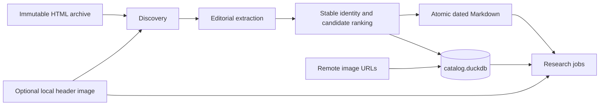

# WSJ Markdown catalog architecture crash course

This is the deep guide to the pipeline's data model, implementation, failure
semantics, and extension workflow. Start with the concise operator path in the
[README](../README.md) if you only need to run or query the pipeline.

## 1. Research mental model

Treat preprocessing as a deterministic adapter between an immutable licensed
archive and many independent research projects.

The input unit is a WSJ HTML file plus an optional sibling header image. The
output unit is a stable article identity with exactly one winning Markdown file
and one `articles` row. Several source files may be candidates for the same
identity; operational tables preserve their provenance and ranking without
storing article bodies.

The shared layer answers only four research questions:

1. What canonical editorial text belongs to this article?
2. When was it published, exactly and on the New York calendar?
3. Which local header image and remote editorial-image URLs belong to it?
4. Where did it come from, and can the result be reproduced incrementally?

Embeddings, entity extraction, knowledge graphs, market joins, labels,
backtests, and remote-image retrieval are downstream concerns.



## 2. One article's journey

1. `discovery.py` recursively finds `.html` files in lexical relative-path
   order. Hidden directories and `__MACOSX` are skipped at every depth; only a
   top-level directory named `backup` is skipped. A nested editorial directory
   named `backup` remains discoverable.
2. Discovery looks beside the HTML for
   `<stem>_main_image.{jpg,jpeg,png,webp}`. That extension order is the winner
   priority. No image is valid; multiple images produce a warning.
3. The coordinator compares the manifest's HTML and selected-image sizes and
   nanosecond mtimes, then classifies the source for preparation.
4. A bounded worker verifies regular source files and safely reads only what
   that classification requires. Matching fingerprints skip extraction. An
   HTML stat-only change is hashed; if the hash matches and the image
   fingerprint did not change, only the manifest is refreshed. Workers never
   own a catalog connection or generated-output write capability.
5. `extract.py` hashes the HTML, reads authoritative publication metadata,
   derives identity, and renders editorial content to deterministic Markdown.
   Missing, malformed, or timezone-naive publication time is a structured
   extraction failure.
6. The candidate is compared with every source carrying the same `article_id`.
   The deterministic best candidate becomes the winner.
7. Its Markdown is written to a run-specific staging directory, reopened,
   SHA-256 checked, and atomically replaced at its dated final path.
8. The serialized coordinator updates the winner, candidate, duplicate,
   failure, and
   manifest state. Nonwinners retain metrics and provenance, not cleaned text.
9. Validation checks the catalog and files while the mutating run still owns
   the exclusive lock. On the normal result path, the CLI returns a
   content-free JSON summary.

The final path is:

```text
text/YYYY/MM/DD/<sha256-of-full-namespaced-article-id>.md
```

`YYYY/MM/DD` is `publication_date_new_york`, not a folder hint or filesystem
date.

## 3. Module map

| Module | Owns | Does not own |
|---|---|---|
| `config.py` | resolved source/output roots, batch size, worker count, nonoverlap check | command behavior |
| `models.py` | immutable records crossing discovery/extraction boundaries | persistence |
| `discovery.py` | stable HTML enumeration and header-image pairing | HTML parsing |
| `extract.py` | metadata, dates, identity, editorial Markdown, remote image URLs | winner persistence |
| `catalog.py` | schema version 1, transactions, manifests, candidates, audit rows | filesystem publication |
| `pipeline.py` | locking, classification, batching, ranking, publication, reconciliation | research transforms |
| `validate.py` | catalog/file/date/hash/path/URL/orphan invariants | repair |
| `cli.py` | four commands, scope safety, deterministic JSON, exit status | domain logic |

The command surface is exactly `inventory`, `run`, `validate`, and `smoke`.
Only `run` mutates configured state. It requires exactly one of a positive
`--limit N` or `--full`; `--reprocess` and a positive `--workers N` override
are valid only with that scope. Configuration defaults to four workers.
`inventory` is read-only and inventories the whole configured source root.
`smoke` ignores configuration and uses a generated temporary archive.

## 4. Cleaned Markdown contract

The canonical file is UTF-8 Markdown in editorial reading order. Extraction
preserves, when present:

- headline; distinct subtitle, dek, and summary; and byline;
- body paragraphs and section headings;
- ordered and unordered lists, tables, and block quotes;
- editorial hyperlinks;
- inline figures and images at their approximate DOM position;
- image alt text, caption, credit, and creator text; and
- relevant visible text in article interactives.

It excludes navigation, ads and tracking, subscription/login/registration
prompts, recommendations and related cards, sharing controls, biographies,
scripts, styles, iframes, hidden nodes, and repeated metadata. Repeated body
text is not deduplicated merely because its words match.

A synthetic shape looks like this:

```markdown
# Example headline

Example dek.

By Example Reporter

Opening paragraph with an [editorial link](https://example.test/story).

## Example section


Example caption. Example credit.
```

Normalization cleans whitespace, applies Unicode normalization, escapes
Markdown control characters, uses deterministic blank lines, and preserves
meaning. It does not paraphrase, translate, lowercase, stem, or summarize.

Only resolved HTTP(S) editorial image URLs enter Markdown and the ordered,
deduplicated `inline_image_urls` list. The pipeline never downloads them. The
local companion header image is a separate nullable source-relative path and
is not injected into article Markdown.

## 5. Catalog schema

`catalog.duckdb` is both the research catalog and the operational state store.
Opening an unsupported or malformed schema fails with instructions to move the
derived output aside or choose a fresh output root. There is no silent
migration or deletion. Public validation uses the same exact table, column,
key, constraint, and index contract through a read-only connection.

### Research-facing table

| `articles` column | DuckDB type | Meaning |
|---|---|---|
| `article_id` | `VARCHAR` | primary key; stable namespaced identity |
| `source_html_path` | `VARCHAR` | unique winning path relative to source root |
| `cleaned_markdown_path` | `VARCHAR` | unique path relative to output root |
| `header_image_path` | `VARCHAR` | nullable path relative to source root |
| `inline_image_urls` | `VARCHAR[]` | ordered, deduplicated remote HTTP(S) URLs |
| `published_at_utc` | `TIMESTAMPTZ` | exact publication instant |
| `publication_date_new_york` | `DATE` | indexed New York research date |
| `cleaned_markdown_sha256` | `VARCHAR` | hash of published Markdown bytes |

The nonunique `articles_publication_date_idx` covers
`(publication_date_new_york, published_at_utc, article_id)`.

### Operational tables

| Table | Primary key | Stored state |
|---|---|---|
| `metadata` | `key` | catalog schema version |
| `runs` | `run_id` | command, scope, status, start/finish times, content-free JSON counts |
| `source_manifest` | `source_html_path` | HTML/image fingerprints, HTML hash, extractor version, status, identity, last-run/last-seen IDs |
| `candidates` | `source_html_path` | identity, URL, dates, ranking metrics, image references, warnings, last run |
| `duplicates` | `(article_id, source_html_path)` | winner path, rank, reason, run ID |
| `failures` | `(run_id, source_html_path, stage)` | stable code and catalog-owned content-free message |

Operational rows contain no cleaned article body. `candidates` retains only
quality counts and metadata needed to rerank a stored source; a candidate is
re-extracted from immutable input if it must be promoted and cannot reuse the
current published winner.

A typical research query is:

```sql
SELECT
    article_id,
    cleaned_markdown_path,
    header_image_path,
    inline_image_urls,
    published_at_utc,
    publication_date_new_york
FROM articles
WHERE publication_date_new_york
      BETWEEN DATE '2024-01-01' AND DATE '2024-01-31'
ORDER BY published_at_utc, article_id;
```

## 6. Identity and duplicate ranking

Identity uses the first available value:

1. `wsj:<trimmed article.id>`;
2. `url:<sha256-of-normalized-canonical-URL>`; or
3. `html:<source-HTML-sha256>`.

Canonical URL normalization lowercases scheme and host, removes fragments and
default ports, removes a trailing slash, and sorts query parameters.

Candidates sharing an identity are sorted by this ascending preference key:

1. nonempty extracted Markdown before empty;
2. greater editorial character count;
3. greater editorial block count;
4. greater metadata completeness;
5. later update timestamp, with a missing update last; and
6. lexical source path.

Only rank 1 owns an `articles` row and Markdown file. Other candidates receive
ranks starting at 2 and one stable reason such as `empty_content`,
`lower_editorial_character_count`, `lower_editorial_block_count`,
`lower_metadata_completeness`, `older_update`, or `lexical_tiebreak`.

## 7. Time semantics

WSJ publication metadata (`article.published`/`datePublished`) is authoritative.
Created, updated, last-published, filenames, folder names, and filesystem times
are never substituted. Updated time participates only in duplicate ranking.

The parser accepts timezone-aware ISO-8601 values, normalizes the instant to
UTC, then derives `publication_date_new_york` with the IANA
`America/New_York` timezone. This deliberately allows the UTC calendar date
and New York calendar date to differ and observes daylight-saving changes.

## 8. Incremental state transitions

```mermaid
stateDiagram-v2
    [*] --> new: no manifest row / previously missing
    [*] --> unchanged: all fingerprints match
    [*] --> stale: extractor version differs
    [*] --> stat_changed: a fingerprint differs
    stat_changed --> metadata_only: HTML hash matches and image fingerprint matches
    stat_changed --> changed: HTML content or selected-image fingerprint changed
    stale --> unchanged: no --reprocess; mark seen
    stale --> reprocessed: --reprocess
    new --> succeeded: extract and publish
    changed --> succeeded: extract and publish
    reprocessed --> succeeded: extract and publish
    new --> failed: structured extraction failure
    changed --> failed: structured extraction failure
    succeeded --> missing: unseen in a completed full run only
```



Runs process lexical discovery in configured-size batches. Within one batch,
source preparation is submitted to a bounded thread pool and applied by the
serialized coordinator as results complete. At most one batch is submitted at
a time, so live work is bounded by both batch size and worker count. Thread
scheduling may change which prepared result is applied first, but identity,
winner ranking, Markdown bytes and paths, research-facing rows, and validation
remain deterministic after a successful run.

Discovery keeps one
sorted entry list for each directory on the active recursion stack, so live
path state is bounded by traversal depth times directory breadth rather than by
the corpus-global HTML count. Only the current HTML directory's image index is
retained, and traversal stops once a limited run yields its first `N` paths. A
limited run never infers deletion. A completed full run reconciles missing
sources in configured-size catalog pages, removes vanished unique winners, or
re-extracts and promotes the next valid duplicate. An absent/non-directory
source root is rejected before run state is created; an interrupted or failed
traversal does not perform reconciliation.

Changing `EXTRACTOR_VERSION` makes prior manifest rows stale. Without
`--reprocess`, they are counted and marked seen but left untouched. This is a
safety gate: a version bump never implies automatic corpus-wide work.
Malformed or timezone-naive optional update timestamps are retained as a
content-free warning and ranked as missing update metadata; the authoritative
publication timestamp remains strict and timezone-aware.

## 9. Atomicity and recovery

One `pipeline.lock` covers worker preparation, serialized mutation, and final
validation. A validated run stays
`running`, with no finish time or summary, until validation and final-summary
persistence complete; only then does it make one terminal `succeeded` or
`failed` transition. Publication uses a run-specific staging directory,
verifies staged bytes, and atomically replaces the deterministic target before
catalog changes commit.

Catalog access rejects a symlink, non-regular file, or multiply linked catalog
leaf before DuckDB can mutate it. Source discovery accepts only regular
non-symlink HTML and local header-image leaves. Hashing, extraction, duplicate
promotion, and validation reopen source-relative paths through no-follow
directory descriptors so a post-discovery leaf swap cannot escape the source
root.

| Failure point | Durable result | Recovery |
|---|---|---|
| before final-file replacement | old file/catalog remain | rerun |
| after replacement, before transaction commit | file may be ahead of catalog | rerun deterministically republishes and commits |
| date/identity change after new commit, before old-file cleanup | valid new row plus harmless old orphan | `validate` reports it; perform the controlled manual cleanup below |
| extraction failure | content-free failure and failed manifest; no invalid research row | fix input/parser and rerun; a valid duplicate may be promoted |
| validation failure | run status becomes failed and CLI is nonzero | inspect issue codes, repair cause, rerun |
| process killed before lock cleanup | stale lock may remain | verify no process is active, remove only the stale lock, rerun |
| incompatible generated schema | pipeline refuses to alter it | move derived output aside or choose a fresh output root |

Markdown replacement preceding transaction commit is intentional: committed
catalog state never points to a new path that was not published. The stored
hash exposes any temporary file/catalog mismatch. Cleanup never follows an
unsafe path or directory symlink.

Full reconciliation also has a durable retry boundary. Source pages are marked
missing before affected identities are recomputed. A missing source remains
pending while an `articles` or `duplicates` row still refers to it, regardless
of which run marked it missing. Each successful identity transaction removes
that pending relation. A later full run therefore resumes after an interruption
between source pages, between phases, or between identity pages without holding
a corpus-sized Python work list.

An unchanged rerun does not sweep a post-commit orphan. To remove one safely:

1. Verify no pipeline process is active and run `validate` to obtain the exact
   output-relative `text/.../*.md` orphan path.
2. Query `articles.cleaned_markdown_path` for that exact relative path and
   continue only if the count is zero.
3. Resolve the candidate beneath the configured output root. Verify every
   parent is a real directory, the leaf is a regular non-symlink `.md` file,
   and the resolved path remains inside the output root's `text/` directory.
4. Delete only that verified file, leave the dated directories in place, and
   run `validate` again.

Never delete a directory tree, a catalogued path, a symlink, or anything below
the source root as orphan recovery.

## 10. Validation

`validate.py` streams catalog rows and generated files instead of accumulating
the corpus in Python. It reports stable, sorted, content-free issue codes for:

- unsupported catalog or extractor versions and malformed relations;
- duplicate article IDs, source paths, or Markdown paths;
- unfinished runs, invalid persisted lifecycle domains, terminal
  status/summary disagreement, and manifest/candidate/article inconsistencies;
- incorrect winner selection, duplicate ranks, reasons, or references;
- failed or missing sources still selected as winners;
- missing, unsafe, or hash-mismatched Markdown files;
- missing or unsafe winning source-HTML and local header-image paths;
- UTC-to-New-York date and dated-path disagreement;
- invalid or duplicated inline HTTP(S) URLs; and
- generated Markdown not referenced by the catalog.

Validation detects; it does not mutate or repair. It hashes each catalogued
Markdown file, so full validation is I/O-intensive even though memory use is
bounded. Orphan traversal does not follow directory symlinks outside the
generated tree. Symlink entries in the orphan walk are ignored rather than
reported; a catalogued path that is a symlink is still reported as unsafe by
the catalog-file checks.

## 11. Test map

All automated tests build synthetic HTML and image fixtures under temporary
directories. They must never read the licensed archive.

| Tests | Contract exercised |
|---|---|
| `test_config.py`, `test_cli_safety.py` | path nonoverlap, four-command surface, scopes, JSON and exit status |
| `test_discovery.py` | layouts, exclusions, order, limits, image priority and warnings |
| `test_dates.py`, `test_extract.py` | editorial Markdown, exclusions, links/images, identity, timestamps, DST |
| `test_catalog.py` | exact schema, constraints, transactions, safe audit channels, classification |
| `test_pipeline.py` | paths, batching, incremental changes, ranking, failures, promotion, full-only removal |
| `test_recovery.py` | lock, interruptions, legacy refusal, path moves, orphan and symlink safety |
| `test_validate.py` | every cross-artifact invariant and streaming behavior |
| `test_smoke.py` | complete generated-fixture workflow and isolation from configured data |

The standard verification set is `pytest -q`, `ruff check .`, and
`wsj-pipeline smoke`.

## 12. Safe extension recipes

### Support another editorial HTML variation

1. Add a minimal generated fixture and a focused failing assertion for reading
   order and exclusions.
2. Change only extraction/rendering logic needed for that variation.
3. If any existing normalized Markdown, identity metadata, image URL, or
   ranking metric can change, bump `EXTRACTOR_VERSION`.
4. Test that stale rows remain untouched without `--reprocess`, then test an
   explicitly bounded reprocess.
5. Update this contract if semantics changed. Never paste licensed text into a
   test or document.

### Change the catalog schema

1. Start with schema, malformed-schema, validation, and query tests.
2. Update table definitions, exact schema validation, catalog methods, pipeline
   writes, validation, and research queries together.
3. Bump `CATALOG_SCHEMA_VERSION`. The current policy is refusal, not automatic
   migration or deletion, so document the fresh-output procedure.
4. Re-run the generated smoke workflow from an empty temporary output.

### Change discovery or image rules

Add generated cases for lexical ordering, exclusions, ambiguity, missing
images, and incremental classification. Preserve remote editorial image URLs
without downloading them. Keep source and output roots disjoint and source
paths relative.

### Change orchestration or recovery

Write an interruption test at the exact boundary first. Preserve exclusive
locking, bounded transactions, file-before-catalog publication, post-commit
orphan cleanup, and full-only missing-source reconciliation.

## 13. Downstream boundaries

- A text embedding job queries `articles`, opens `cleaned_markdown_path`, and
  writes vectors outside the preprocessing output root.
- A multimodal job may combine Markdown with the source-relative
  `header_image_path`. It may independently choose whether to retrieve remote
  `inline_image_urls`; this pipeline never does so.
- A temporal graph uses `published_at_utc` as the event instant and
  `publication_date_new_york` for trading-day/calendar joins.
- Market data, labels, models, summaries, graphs, and backtests get their own
  schemas and lifecycles. They must not add fields or tables to this catalog
  merely for one research project.

## 14. Code-reading order

For a first pass, read `config.py` and `models.py`, then `discovery.py` and the
public entry points in `extract.py`. Next read the schema and classification
methods in `catalog.py`, followed by the lifecycle, ranking, and publication
helpers in `pipeline.py`. Finish with `validate.py`, `cli.py`, and the matching
test files. This order follows one source from discovery to research query.

## 15. Glossary

- **article identity**: namespaced stable key beginning `wsj:`, `url:`, or
  `html:`.
- **candidate**: one extracted raw source competing for an article identity.
- **winner**: rank-1 candidate owning the canonical Markdown and `articles`
  row.
- **header image**: optional local sibling file referenced relative to the
  source root.
- **inline image URL**: remote HTTP(S) editorial reference preserved in order,
  never downloaded here.
- **manifest**: cheap source/image fingerprints plus processing status used for
  incremental classification.
- **metadata-only**: HTML stats changed, but its hash and header-image
  fingerprint did not; extraction is skipped.
- **stale extractor**: stored candidate was produced by an older extractor
  version and needs explicitly scoped reprocessing.
- **full reconciliation**: missing-source inference performed only at the end
  of a completed `run --full`.
- **orphan**: generated Markdown not referenced by the current `articles`
  table.
- **content-free failure**: stable code/message that contains no licensed
  article excerpt.
