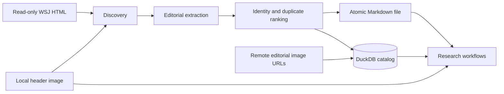

# Simplified WSJ Cleaning and Catalog Design

**Date:** 2026-08-01

**Status:** Approved for implementation planning

**Scope:** Clean the licensed WSJ HTML/image archive into canonical Markdown
files and a minimal, safe DuckDB research catalog.

## Purpose

The archive contains roughly one hundred WSJ articles per day across many
years. Each raw article is an HTML file with an optional local companion header
image. The shared preprocessing layer should do only what future research
projects need in common:

1. preserve all editorial article text in a clean, deterministic format;
2. retain references to the local header image and linked editorial images;
3. retain exact publication time and an indexed New York publication date;
4. provide stable identity, provenance, duplicate handling, and incremental
   updates; and
5. expose those artifacts through one small DuckDB catalog.

Text/image embedding, temporal knowledge graphs, market data, labels,
backtests, and trading strategies remain downstream. The preprocessing layer
does not embed, summarize, classify, fetch market data, or download remote
images.

## Safety and Scale Constraints

- `data/wsj_archive/` is immutable input. The pipeline never renames, rewrites,
  moves, or deletes raw HTML or images.
- All generated state is written below the configured output root, which must
  not overlap the source root.
- Raw and derived data remain ignored by Git.
- Automated verification uses generated temporary fixtures only.
- `run` requires exactly one of a positive `--limit` or explicit `--full`.
- No agent may launch a corpus-wide run unless the user authorizes it in the
  current task.
- Work is committed in bounded batches so a full run does not require loading
  the archive into memory.
- Logs, failures, fixtures, documentation, and commits never contain licensed
  article excerpts.

## Architecture



The pipeline has two research-facing outputs:

1. one canonical UTF-8 Markdown file per unique publishable article; and
2. one `articles` row in a single DuckDB database pointing to that Markdown,
   the local header image, linked editorial-image URLs, and publication dates.

DuckDB also holds the minimal operational tables required for incremental
processing and auditing. There is no Parquet layer, separate operational
database, or separately rebuilt publication index.

## Source Discovery

Discovery recursively enumerates `.html` files in stable lexical order. It
supports both observed layouts, such as `2016/*.html` and
`2023/2023/*.html`, and future year directories without code changes.

The implementation preserves that global ordering with a lazy recursive walk
rather than a corpus-sized path list. Each active recursion frame retains its
directory's sorted entries, so live traversal state is bounded by directory
breadth across the active depth. A limited run stops traversal after the
requested number of candidates, and only the current source directory's
header-image index remains cached.

Hidden directories, `__MACOSX`, and a top-level `backup` directory are excluded.
A local header image is a sibling with the same HTML stem plus
`_main_image` and one of these extensions, in priority order:

1. `.jpg`
2. `.jpeg`
3. `.png`
4. `.webp`

No header image is a valid condition. If several candidates exist, discovery
uses the extension priority deterministically and records a warning.

Each discovered source records relative paths, byte sizes, and nanosecond
modification times for the HTML and selected header image. These inexpensive
fingerprints drive incremental classification; content hashing resolves stat
changes when needed.

## Cleaned Markdown Contract

Each canonical article is written as deterministic UTF-8 Markdown. Editorial
content is preserved in reading order.

Included content:

- headline;
- subtitle, dek, and summary, without repeating identical text;
- byline;
- body paragraphs;
- section headings;
- editorial lists and tables;
- pull quotes;
- editorial hyperlinks;
- inline figures and editorial image URLs;
- image alt text, captions, credits, and creator text; and
- relevant visible text belonging to article interactives.

Excluded content:

- global navigation and page chrome;
- advertisements and tracking elements;
- subscription, registration, and login prompts;
- recommended and related-story cards;
- social-sharing controls;
- author biographies;
- scripts, styles, and hidden accessibility duplicates; and
- repeated metadata already represented once in the article.

Markdown uses conventional constructs rather than a custom container format:

```markdown
# Headline

Subtitle or dek.

By Alice Reporter and Bob Editor

Opening paragraph with an [editorial link](https://example.com).

## Section heading


Image caption. Image credit.
```

Normalization is conservative: Unicode normalization, whitespace cleanup,
deterministic blank lines, and stable Markdown escaping. The pipeline does not
lowercase, stem, summarize, translate, paraphrase, or alter editorial meaning.

Remote editorial images are not downloaded. Their resolved HTTP(S) URLs appear
at their approximate reading positions in the Markdown and, without duplicates,
in the ordered `inline_image_urls` catalog list. The local companion header
image remains a separate nullable relative path.

## Identity and Duplicate Selection

The stable `article_id` is derived in this order:

1. `wsj:<trimmed WSJ article ID>`;
2. `url:<SHA-256 of normalized canonical URL>`; or
3. `html:<source HTML SHA-256>`.

Canonical URL normalization lowercases the scheme and host, removes fragments
and default ports, normalizes the trailing slash, and sorts query parameters.

Several raw sources may resolve to one article ID. All publishable candidates
have a valid publication timestamp. The winner is selected deterministically
by this ascending preference order:

1. nonempty editorial content;
2. greater cleaned editorial character count;
3. greater count of extracted editorial blocks;
4. greater metadata completeness;
5. later WSJ update timestamp; and
6. lexical source path.

Only the winner has a canonical Markdown file and an `articles` row.
Nonwinners retain identity, quality metrics, source hashes, and their winner
reference in operational tables, but their cleaned article text is not stored.
If the winner disappears or becomes invalid during a completed full run,
remaining raw candidates are re-extracted as needed and the next ranked source
is promoted.

## Publication Dates and Output Paths

The authoritative event time is WSJ `datePublished`/publication metadata. A
missing, malformed, or timezone-naive publication timestamp is a structured
failure and produces no research record.

The exact timestamp is normalized to timezone-aware UTC as
`published_at_utc`. The pipeline derives
`publication_date_new_york` using the IANA `America/New_York` timezone,
including daylight-saving transitions. Created, updated, and last-published
timestamps are never silently substituted for publication time.

The canonical Markdown path is:

```text
text/YYYY/MM/DD/<stable-article-hash>.md
```

`YYYY/MM/DD` comes from `publication_date_new_york`. The filename is the
hexadecimal SHA-256 of the full namespaced `article_id`, which avoids unsafe
title characters and collisions while keeping identity readable in DuckDB.

## Generated Layout

```text
data/processed/wsj/
├── catalog.duckdb
├── text/
│   └── YYYY/
│       └── MM/
│           └── DD/
│               └── <stable-article-hash>.md
├── staging/
└── pipeline.lock
```

All paths stored in DuckDB are relative to the configured source or output
root, as appropriate. This makes the catalog portable with its corresponding
directories.

## DuckDB Catalog

The catalog schema is explicitly versioned. Opening a database with an
unsupported schema fails with a concise instruction; the pipeline does not
silently migrate or delete generated data.

### Research-facing `articles`

| Column | DuckDB type | Constraint and meaning |
|---|---|---|
| `article_id` | `VARCHAR` | Primary key; stable namespaced identity |
| `source_html_path` | `VARCHAR` | Unique winning source path relative to the archive |
| `cleaned_markdown_path` | `VARCHAR` | Unique path relative to the output root |
| `header_image_path` | `VARCHAR` | Nullable path relative to the archive |
| `inline_image_urls` | `VARCHAR[]` | Ordered, deduplicated remote editorial image URLs |
| `published_at_utc` | `TIMESTAMPTZ` | Exact authoritative publication instant |
| `publication_date_new_york` | `DATE` | Indexed New York research date |
| `cleaned_markdown_sha256` | `VARCHAR` | Integrity hash of the published Markdown bytes |

An index on `(publication_date_new_york, published_at_utc, article_id)` supports
exact-day and bounded-range research queries.

### Operational tables

- `metadata`: the catalog schema version; extractor versions live on
  `source_manifest`, `candidates`, and `failures`, where per-source staleness
  can be validated and reprocessed explicitly;
- `runs`: command, scope, timestamps, status, and content-free counts;
- `source_manifest`: source/image fingerprints, hashes, status, article ID,
  extractor version, and last-seen run;
- `candidates`: source-to-identity mapping and deterministic ranking metrics;
- `duplicates`: nonwinner source, winner source, rank, and reason; and
- `failures`: run, source, stage, stable error code, and content-free message.

The operational tables are implementation state, not the primary research
interface. They do not retain cleaned article bodies.

## Incremental Processing

One mutating process owns an exclusive `pipeline.lock`. A normal run:

1. creates a `running` run record;
2. discovers sources in deterministic order;
3. classifies candidates against `source_manifest`;
4. processes new or changed candidates in bounded transactions;
5. recomputes winners for affected identities;
6. stages and atomically replaces changed canonical Markdown files;
7. commits article, candidate, duplicate, and manifest changes;
8. validates changed outputs and catalog invariants;
9. records a succeeded or failed summary; and
10. removes the lock.

Classification distinguishes:

- `new`: no manifest row;
- `unchanged`: HTML and header-image fingerprints match;
- `metadata_only`: stats changed but content and selected image identity did not;
- `changed`: HTML content or selected header image changed;
- `stale_extractor`: stored extractor version differs; and
- `missing`: a prior source was absent from a completed full inventory.

Extractor-version changes never trigger automatic corpus-wide work. Stale
sources are reported and require `--reprocess` together with `--limit` or
`--full`.

A completed `--full` inventory marks previously known unseen sources missing
in bounded catalog pages. A limited or interrupted run never infers deletion
from unseen paths. An absent/non-directory source root is rejected before a run
begins, and a traversal error aborts before reconciliation. Adding 2024–2026
folders and rerunning `run --full` therefore processes only new or changed
sources while safely reconciling genuine removals.

## Atomicity and Crash Recovery

For a winning candidate, publication proceeds as follows:

1. render Markdown bytes deterministically;
2. write them under a run-specific staging directory;
3. reopen the staged file and verify its SHA-256;
4. atomically replace the deterministic final path; and
5. commit the related catalog and manifest updates in one DuckDB transaction.

The source manifest is committed only after final-file replacement. If a
process stops after replacement but before the catalog commit, the source still
appears unprocessed and the next run deterministically repairs the catalog and
file. The stored Markdown hash lets validation detect the temporary mismatch.

If a corrected date changes the output path, the new file is published before
the catalog switches paths. The obsolete generated file is removed only after
the catalog commit. A crash can therefore leave a harmless orphan, but never a
committed row pointing to a replacement that was not published. Validation
reports orphaned Markdown files.

Failures close the run lifecycle as `failed` without exposing article text.
The lock file is removed in a `finally` path. If the process itself is killed
before cleanup, an operator verifies no process is active, removes only the
stale lock, and reruns the idempotent command.

## CLI

The installed command is `wsj-pipeline` with four subcommands:

- `inventory`: read-only discovery and image counts for the configured source
  root;
- `run (--limit N | --full) [--reprocess]`: incremental cleaning and catalog
  update;
- `validate`: complete catalog/file/date/orphan validation; and
- `smoke`: complete generated-fixture workflow in a temporary directory.

All commands emit deterministic JSON summaries. `validate` and `run` return a
nonzero exit status when validation fails. `smoke` ignores the configured real
archive and cannot process licensed corpus data.

The optionless `inventory` synopsis is the implementation-time resolution of
the earlier draft's `inventory [--limit N]`: bounded mutation remains explicit
on `run --limit N`, while inventory describes the complete configured source.

## Validation

Validation reports stable, content-free issue codes and checks:

- the exact same-version table/column/key/constraint/index contract through a
  read-only connection, plus supported catalog and extractor versions;
- unique article IDs, source paths, and cleaned Markdown paths;
- existence of every catalogued Markdown file;
- Markdown SHA-256 agreement;
- existence of catalogued local header images;
- exact UTC-to-New-York date derivation;
- agreement between New York date and `YYYY/MM/DD` path;
- valid HTTP(S) inline image URLs and stable list ordering;
- candidate, duplicate-winner, manifest, and article consistency;
- no `running` run left by a completed command;
- no catalog row for a failed or missing winner; and
- generated Markdown files not referenced by the catalog, without following
  directory symlinks.

Validation scans paths and files incrementally rather than retaining the corpus
in Python memory. A full validation can still be I/O-intensive because it hashes
every cleaned file, so automated tests exercise it only on temporary fixtures.

## Testing

All tests create small synthetic HTML and image fixtures under temporary
directories. Required coverage includes:

- mixed archive layouts and excluded directories;
- missing and ambiguous header images;
- complete editorial reading order;
- removal of ads, related cards, prompts, biographies, scripts, and chrome;
- Markdown escaping, Unicode, headings, lists, tables, quotes, and links;
- inline editorial image URLs, captions, credits, ordering, and deduplication;
- publication parsing, distinct UTC/New York dates, and daylight saving;
- stable identity fallbacks and duplicate ranking;
- unchanged reruns, HTML changes, image-only changes, and extractor staleness;
- bounded committed batches and interruption recovery;
- winner removal and duplicate promotion during full runs;
- the rule that limited runs never reconcile unseen sources;
- future-year additions;
- catalog constraints, file hashes, path dates, missing files, and orphans;
- lock contention and failed run lifecycle; and
- a fixture-only end-to-end smoke command.

Implementation verification runs only the fixture test suite, lint, package
build, and generated `smoke` command. It does not launch real-corpus extraction.

## Package Boundaries

The implementation is organized into focused modules:

- `config.py`: safe resolved paths and bounded settings;
- `models.py`: discovery and extraction value objects;
- `discovery.py`: stable HTML enumeration and header-image pairing;
- `extract.py`: editorial Markdown, structured metadata, dates, and image URLs;
- `catalog.py`: DuckDB schema and transactional state access;
- `pipeline.py`: locking, incremental orchestration, duplicate decisions, and
  atomic Markdown publication;
- `validate.py`: catalog, filesystem, date, hash, and orphan invariants; and
- `cli.py`: argument safety and deterministic JSON output.

The old Parquet publisher, separate state/index services, and their commands are
removed. Dependencies used only by that architecture, including PyArrow, are
removed.

## Research Interface

Typical date-range discovery is a direct catalog query:

```sql
SELECT
    article_id,
    cleaned_markdown_path,
    header_image_path,
    inline_image_urls,
    published_at_utc,
    publication_date_new_york
FROM articles
WHERE publication_date_new_york
      BETWEEN DATE '2024-01-01' AND DATE '2024-01-31'
ORDER BY published_at_utc, article_id;
```

Text embedding jobs open `cleaned_markdown_path`. Multimodal jobs combine that
file with `header_image_path` and may independently decide whether and how to
retrieve `inline_image_urls`. Temporal graph jobs use the exact timestamp and
New York date as event-time anchors. These downstream jobs write outside the
preprocessing output contract.

## Documentation Architecture

There are exactly two user-facing documentation entry points:

1. `README.md`: concise installation, safety, smoke-to-full operation, common
   queries, output layout, and navigation; and
2. `docs/architecture-crash-course.md`: the single deep guide for researchers,
   maintainers, and coding agents.

The crash course moves from the research mental model through an article's
end-to-end journey, module boundaries, schema and state transitions, recovery,
validation, testing, safe extension recipes, downstream attachment points, a
code-reading order, and a glossary.

`AGENTS.md` remains a coding-agent control file rather than a third user guide.
This design specification is the architectural decision record, and the
implementation plan is execution history. They link to current user-facing
documentation without duplicating it.

Documentation verification checks CLI help, module/table inventories, internal
Markdown links, fixture tests, lint, package build, the generated smoke command,
and Git's tracked-file list. It never reads or processes the licensed archive.

## Migration and Compatibility

The simplified catalog is intentionally incompatible with the earlier
Parquet-oriented prototype. Because all generated output is ignored and
reproducible, no automatic migration is provided. If an existing output root
contains the legacy schema, the new pipeline stops with a concise instruction
to move that derived directory aside or choose a fresh output root. It never
deletes either legacy derived output or raw source data automatically.

The source archive layout and default source path remain compatible. The
research interface changes from Parquet plus a separate date index to Markdown
paths plus the single `articles` catalog table.
